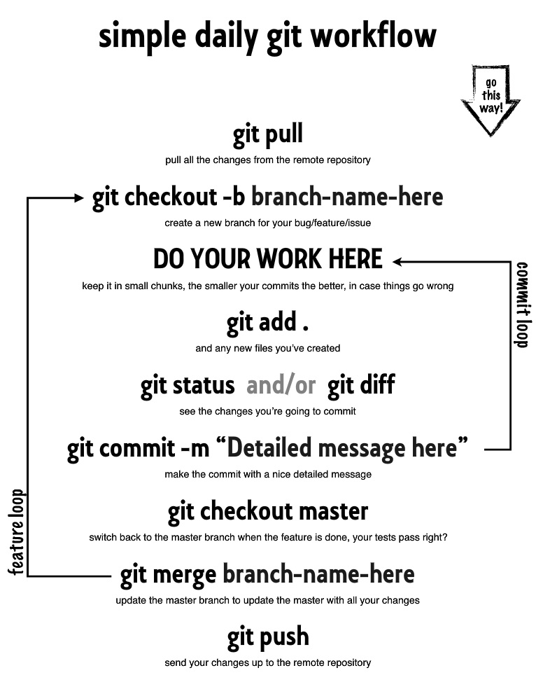

# Control de versiones con Git

## Introducción

Un controlador de versiones es una herramienta que gestiona los
cambios de un conjunto de archivos. Cada conjunto de cambios genera
una nueva versión de los archivos. El controlador de versiones
permite, además de la gestión de cambios, recuperar una versión vieja
de los archivos o un archivo, así como resolver conflictos entre versiones.

Aunque su principal uso es para agilizar la colaboración en el
desarrollo de proyectos de *software*, también puede utilizarse para
otros fines (como estas notas) e inclusive para trabajar solo (como en
una tesis o proyecto.)

Especificamente, un controlador de versiones ofrece lo siguiente:

1. Nada de lo que es *"comiteado"* (_commited_, ahorita vemos que es eso)
   se perderá.
2. Lleva un registro de *quién* hizo *qué* cambios y *cuándo* los
   hizo.
3. Es *casi* imposible (nota el casi...)  sobreescribir los cambios de tu
   colaborador. El controlador de versiones notificará que hay un
   **conflicto** y pedirá que lo resuelvas antes de continuar.

En esta clase usaremos `git`, aunque debemos de notar que no es el
único controlador de versiones que existe, entre los más populares se
encuentran `bazaar`, `mercurial` y `subversion` (Aunque este último
pertenece a una diferente clase de controladores de versiones).


## Un poco de inspiración

Git no se debe de confundir con Github. Sin embargo, servicios como Github y Gitlab han hecho que el uso de git sea tan popular.

Recordemos que Git es un software aparte de Github pero es lo que verdaderamente
hace que todo funcione. Vive en tu computadora y puedes trabajarlo en local si
así lo deseas.


## Configurando tu git

Abre una terminal y ve a tu carpeta `$HOME`. 
Ahí, teclea lo siguiente, para establecer el usuario, correo
(que usará `Github` para identificarte por ejemplo), si colorea la
salida, y qué editor usará por default para resolver conflictos.

```{bash eval=FALSE}
git config --global user.name "<Tu Nombre>"
git config --global user.email "<Tu correo-e>"
```


[Para más opciones de configuración usa esta liga.](http://git-scm.com/book/en/Getting-Started-First-Time-Git-Setup)


## Creando un repositorio

El **repositorio** es la carpeta donde `git` guarda y gestiona todas
las versiones de los archivos.

Crea una carpeta en tu `$HOME` llamada `test`, ingresa a
ella e inicializa el repositorio con `git init`. ¿Notas algún cambio?
¿Qué comando usarías? Hay una carpeta ahí ¿no la ves? ¿Cómo puedes ver
una carpeta oculta?

La carpeta `.git` es la carpeta donde se guarda todo el historial, si
la borras, toda la historia del repositorio se perderá.

Podemos verificar que todo esté bien, con el comando `status`.

```{bash eval=FALSE}
git status
> On branch main
> Initial commit
> nothing to commit (create/copy files and use "git add" to track)
```

## Llevando registro de los cambios a archivo

Crea un archivo llamado `hola.txt` de la siguiente manera (ALERTA:
nuevos comandos de **CLI**):

```{bash eval=FALSE}
touch hola.txt
echo "¡hola mundo!" > hola.tx
git status
```

(Para ver el contenido de `hola.txt` utiliza el comando `cat hola.txt`).

El mensaje de `untracked files` significa que hay archivos en el
repositorio de los cuales  `git` no está llevando registro, para que
`git` lo haga, debes de **agregarlos** (`add`):

```{bash eval=FALSE}
git add hola.txt
git status
```

Ahora `git` sabe que debe de llevar registro de los cambios de
`hola.txt`, pero aún no se *comprometen* los cambios al repositorio
(`Changes to be commited: ...`). Para *comitearlos*:

```{bash eval=FALSE}
git commit -m "Saludando"
```

Usamos la bandera `-m` para agregar un mensaje que nos ayude a
recordar más tarde que se hizo y por qué. El mensaje es *obligatorio*.

Si ejecutamos
```{bash eval=FALSE}
git status
```
nos indica que todo está actualizado (`up to date`). Podemos ver la
historia de cambio con `git log`.


Edita `hola.txt` usando emacs, luego, ejecuta `git status`

La parte clave es `no changes added to commit`. Hemos cambiado el
archivo, pero aún no están "comprometidas" o guardadas en el repositorio.
Para ver que ha cambiado usamos lo siguiente

```{bash eval=FALSE}
git diff
```

Hagamos `commit` de estos cambios.

```{bash eval=FALSE}
git commit -m 'actualizamos hola.txt'
```

Pero `git` no nos dejará, ya que no lo agregamos antes al índice del
repositorio. Agrégalo y repite el `commit` (¿Recuerdas como hacerlo
con los tips de navegación?).

## El flujo de trabajo

Git maneja este flujo:

Modificando los archivos --> `git add` --> en el área de *staging*
(listos para *commit*) --> `git commit` --> Repositorio (guardados
permanentemente en **tu** computadora.)

Modifica de nuevo `hola.txt`. Observa los cambios y agrégalo. ¿Qué
sucede si vuelves a ejecutar `git diff`?

`Git` dice que no hay nada, ya que para `git` no hay diferencia entre
el área de *staging* y el último *commit* (llamado `HEAD`). Para ver los cambios, ejecuta

```{bash eval=FALSE}
git diff --staged
```

esto muestra las diferencias entre los últimos cambios *comiteados* y
lo que está en el área de *staging*. Ahora realiza el `commit`, verifica
el estatus y revisa la historia.

## Recapitulando. Los verbos más importantes.

### Agregar (Adding)

Cuando haces cambios o agregas archivos o carpetas, quieres ponerlos 
bajo el controlador de versiones. 

Para esto, debes hacerle saber a *git* cuáles son los archivos sobre los cuáles
tiene que poner atención (es decir, en lenguaje git, quieres que tracké (**track**)
esos cambios y/o archivos).

**Git add** es la operación que permite que agregues (*add*) esos cambios al
índice (**index**) (la manera en la que git mantiene el registro de todos los 
cambios).

Algunos tips para utilizar `git add`

- `git add .` agrega todos los cambios/archivos *nuevos* correspondientes al directorio o subdirectorio en el que estas (¿Recuerdas pwd? Los archivos ahí.)
- `git add -u .` agrega al índice todos los cambios de los archivos que ya estaban en el índice pero que fueron *modificados* en el directorio o subdirectorio en el que estas.
- `git add -A` agrega *todo* [¡tengan cuidado!]

Una vez que agregas unos cambios, se dice que éstos están *staged*. De cualquier
modo, puedes cambiar de opinión acerca de los cambios utilizando `git reset HEAD <file>`.

### Comiteando (commiting)

Puedes commitear (**commit**) los cambios que han sido *staged*. Los commits son 
la manera de decirle a git que ese es un checkpoint. Igual que en juegos de 
computadora, un commit es un conjunto de cambios que ameritan que git guarde una
versión de el repositorio *hasta ese momento*. Esta es la operación en la que
realmente sucede el *versionamiento*. 

Son, básicamente, **snapshots** de todos los archivos que ya stageaste para comitear.

Cada vez que commiteas, debes de proveer de un mensaje acompañante que resuma los
cambios realizados. Al menos, esa es la idea...


*Figura tomada de [XKCD](https://xkcd.com/1296/).*

Sean amables con sus compañeros de equipo y con **su yo futuro**. Los mensajes de
*commit* son útiles en el futuro cuando ya ni recuerdan qué hicieron o por qué.

Lo único que deben hacer es...

```{bash eval=FALSE}
git commit -m "mensaje sencillo, INFORMATIVO y simple aquí"
```

## Explorando el pasado

Podemos ver los cambios entre diferentes **revisiones**, podemos usar
la siguiente notación: `HEAD~1`, `HEAD~2`, etc. como sigue:

```{bash eval=FALSE}
git diff HEAD~1 hola.txt
git diff HEAD~2 hola.txt
```

También podemos utilizar el identificador único (el número enorme que
aparece en el `git log`), inténtalo.

Modifiquemos de nuevo el archivo `hola.txt`. ¿Qué tal si nos
equivocamos y queremos regresar los cambios? Podemos ejecutar el
comando

```{bash eval=FALSE}
git checkout HEAD hola.txt
```

(Nota que `git` recomienda un *shortcut* para esta operación: `(use "git checkout -- <file>..." to discard changes in working directory)`)

Obviamente aquí podemos regresarnos las versiones que queramos, por lo
que podemos utilizar el identificador único o `HEAD~2` por ejemplo.

> **Ejercicio**
> Recorre el log con `checkout`, observa como cambia el archivo,
> usando `cat`.
Por último, `git` tiene comandos `mv` y `rm` que deben de ser usados
cuando queremos mover o borrar un archivo del repositorio, i.e. `git
mv` y `git rm`.

> **Ejercicio**
> Crea un archivo `adios.txt`, comitealo, has cambios, comitea y luego
> bórralo. No olvides hacer el último `commit` también.

## Ayuda

Nadie sabe todo. Accesar a la ducumentación siempre es la mejor opción. Poco a 
poco te aprenderás los verbos de git.

Para accesar al manual de cada verbo solamente escribe en la terminal:

```{bash eval=FALSE}
git help <verb>
git <verb> --help
man git-<verb>
```

donde el <verb> se refiere a cualquier comando en git (y en general, si utilizas
la última forma (Si no conoces el comando, solo pregúntale a Google lo que
quieres hacer y checa las distintas posibilidades para elegir la que más se 
acomoda a tu necesidad.)

Antes de continuar con [**Github**](http://github.com) quiero
recomendar que impriman la que mas les guste de estas ayudas visuales
[1](http://jan-krueger.net/wordpress/wp-content/uploads/2007/09/git-cheat-sheet.pdf),
[2](http://www.git-tower.com/blog/git-cheat-sheet-detail/),
[3](https://github.com/mattharrison/Git-Supervisual-Cheatsheet) o [esta](http://ndpsoftware.com/git-cheatsheet.html)
que es interactiva.

El concepto que no alcancé a ver aquí y que es muy poderoso es el de
*stash*, pero pueden deducir su comportamiento de la última ayuda visual.

# Github

## ¿Qué cambia de git a Github?

Github  es un repositorio central, con una interfaz web bonita, pero
fuera de eso, nada impediría que trabajen ustedes con su computadora y
la de sus amigos usando los comandos que en esta sección vamos a
mostrar, ya que `git` es un sistema distribuito de control de
versiones y **ningún nodo** tiene preferencia sobre los demás, pero
por comodidad, podemos usar **Github** de tal manera.

Los comandos de transporte, git `clone`, `pull` y `push`.

## Configuración de credenciales

Github siempre pedirá tu contraseña y tu password. Como están trabajando en sus
computadoras, no queremos que nos pida una y otra vez las credenciales pues
alenta mucho el flujo de trabajo. Nunca dejen sus credenciales en cualquier 
computadora.

Si no se configuran las credenciales, cada vez que quieras hacer `clone`, 
`pull` o `push` de un repositorio privado, te pedirá tus credenciales.


## El repositorio del repo-clase

El repositorio está en:

```
https://github.com/skalas/EC2022
```

## Ejercicio: Forks

Una vez que tengas configuradas tus credenciales, asegurate de clonar tus repositorios
usando el conector ssh apropiado, es decir, vayan al [repo de prueba](https://github.com/skalas/repo-prueba)  y generen un Fork, *En su fork* vayan a la sección de
*Clone* en la esquina superior derecha. Pueden copiar el link directo de la interfaz como se muestra en la imagen.
Noten que, si hubieran configurado sus credenciales con **https** y no con **ssh**
deberán copiar el otro link (que normalmente es `git@github.com/<usuario-u-organizacion/<nombre-del-repositorio>.git`)

Es importante que sepan de la otra manera de configurar pues, en muchos casos,
la conexion por ssh está bloqueada en las empresas y no podrán replicar esa 
configuración en sus computadoras de trabajo.

Regresando a nuestro caso, el link que copiaron debe verse `git@github.com:<usuario-u-organizacion/<nombre-del-repositorio>.git`.

Después, se van a la terminal, buscan el directorio en el que quieren tener
su repositorio y lo clonan ahí.

```{bash eval=FALSE}
git clone git@github.com/<usuario_github>/repo-prueba.git
```

Esto creará una carpeta `repo-prueba` en su directorio en el que lo hayan
puesto. Por ahora, supongamos que lo clonaron directo en su `$HOME`.

Ve a la carpeta `Alumnos` y crea una carpeta cuyo nombre sea tu nombre
de usuario en github.

Crea dentro de tu carpeta un archivo que se llame `<NombreAlumno>.md`,
con los datos que están en el ejempl,o agrégalo,
verifica los cambios, has `commit`. El siguiente paso es
**subir** los cambios al repositorio de github. Para hacerlo hacemos

```{bash eval=FALSE}
git push origin main
```

El verbo `push` es el encargado de la acción de subir los
cambios. `origin` se refiere al repositorio del cual clonamos la copia
local (en nuestra computadora) y `main` se refiere al `branch` (este
es un tema avanzado, por ahora ustedes trabajaran siempre en el branch main, que es el default).

Abre tu repositorio en github y observa que tus cambios ahí
están. Ahora, vamos a simular que alguien está interactuando con tu
repositorio. Desde el sitio web, ve a tu carpeta y has clic en el
símbolo de `+` para agregar un archivo (verifica de nuevo que estés en
tu carpeta). Llamalo `<NombreAlumno>.md` y agrega algo de texto. Para
guardar los cambios aprieta el botón `Commit new file`.


```{bash eval=FALSE}
git pull origin main
```

En tu carpeta debería de aparecer el archivo `prueba2.txt`. Ahora
quedan por contestar dos preguntas: (1) ¿Cómo actualizo el repositorio
`Skalas/repo-prueba` (para entregar tarea, por ejemplo)
y (2) ¿Cómo actualizo mi repositorio con los cambios del repositorio
de `Skalas/repo-prueba`?

Para ambas preguntas es necesario aclarar el concepto de los `remote`:
Si ejecutas

```{bash eval=FALSE}
git remote -v
origin  https://github.com/<usuario>/repo-prueba.git (fetch)
origin  https://github.com/<usuario>/repo-prueba.git (push)
```

Vamos a agregar como `remote` el repositorio
`Skalas/repo-prueba`:

```{bash eval=FALSE}
git remote add otro-repo https://github.com/Skalas/repo-prueba.git
```

Ejecuta de nuevo `git remote -v`

```{bash eval=FALSE}
git remote -v
origin  https://github.com/<usuario>/repo-prueba.git (fetch)
origin  https://github.com/<usuario>/repo-prueba.git (push)
otro-repo      https://github.com/Skalas/repo-prueba.git (fetch)
otro-repo      https://github.com/Skalas/repo-prueba.git (push)
```

Entonces, la respuesta a la primera pregunta (¿cómo entrego mi tarea?) 
es una procedimiento llamado `pull-request` que en general se hace desde el navegador.
Has
click en `Pull Requests` 
y sigue las instrucciones de la pantalla.

Una vez **autorizado** el `pull-request` es necesario hacer

```{bash eval=FALSE}
git pull otro-repo main
git push origin main
```

La primera instrucción baja los cambios del repositorio central a su copia **local**
del repositorio, el segundo los sube a su repositorio particular (otra copia pero 
la versión que guarda github en su fork particular).

Para responder la segunda pregunta (¿cómo bajo lo que han subido otros al repo central?) 
usamos la misma cadena de comandos:

```{bash eval=FALSE}
git pull otro-repo main
git push origin main
```

Nota que ahora no realizamos un `pull-request`.


## ¿Cuál debería de ser mi *FLujo* de trabajo?

En el día a día, se recomienda tener un sano *workflow* de github. Es sencillo
y pronto te será muy natural.



> Trabajo en equipo usando git

Una posible forma de utilizar un worklow distribuido en equipos es el [Integration Manager Workflow](http://git-scm.com/book/en/Distributed-Git-Distributed-Workflows#Integration-Manager-Workflow). En particular, este es el flujo que utilizaremos en el otro-repo pues
ustedes no tienen permisos de escribir en el repositorio de clase de manera directa, es decir,
siempre deben de pasar por un **pull request** que debe ser autorizado por el 
profesor.

> **Ejercicio**
> En esta parte, realizaremos un ejemplo completo del workflow que se espera
> utilicen para entregar sus tareas y proyectos.

Asumiendo que clonaron en su home (sino vayan al lugar donde tienen el folder del repo).

```{bash eval=FALSE}
cd repo-prueba
git pull origin main # SIEMPRE empezamos con un pull. ¿Por qué?
```

- trabajas en varios archivos
- trabajas
- editas
- hackeas

Y conforme avances (unas cuantas veces al día o cuando por fin algo te salió y 
funciona)

```{bash eval=FALSE}
git status
git add <archivos modificados o nuevos>
git commit -m "<comentario acerca de que fue lo que se cambió>"
git push origin main
git status
```

Todo estará bien si

- `git status` respondió con:

```
On branch main
Your branch is up-to-date with 'origin/main'.
nothing to commit, working directory clean
```

- En tu repo están tus cambios.

Cuando quieran enviar la tarea realizan el `pull-request`. Y habrán
terminado si en el repositorio `Skalas/ec2022`
están sus cambios. Los profesores no aceptarán sus cambios si su tarea rompe el 
trabajo de alguien más. Por eso es que estaremos utilizando este workflow.


## .gitignore

`.gitignore` es un archivo específico de texto plano pensado para que 
no se suban archivos a los repositorios que, aunque 
pueden ser útiles en el ambiente local, si subimos a github pasara una de las
siguientes:

- Github no te lo permitirá pues el archivo es muy grande. Pasa seguido entre los que trabajan con grandes datos.
- Está dentro de los limites de Github pero todos los que comparten repositorio contigo te odiarán pues se tardará siglos en bajar tu actualización.
- Tendras un repositorio muy sucio.

Para eso, está diseñado el archivo `.gitignore` pues, básicamente, permite definir
extensiones que por default nunca te mostrará a la hora de pedir un `git status`.

Para *overridear* el `.gitignore` se debe de agregar el archivo con la bandera `-f`. Piensen
muy bien antes de hacer esto pero a veces es necesario. 

El repositorio que compartimos tiene uno en el *home* [del repo](https://github.com/Skalas/ec2022/blob/main/.gitignore).

Se pueden poner tantos `.gitignore` como subfolders existan en un repositorio y
aplican de arriba hacia abajo, es decir, aplican para el lugar en donde estén y 
para todas las subcarpetas contenidas en ese directorio.
